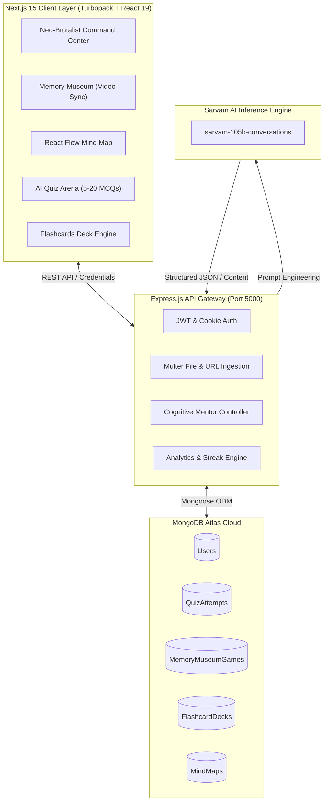

# ⚡ LUMEN AI — Autonomous Cognitive Architecture & Gamified Learning Arena

<div align="center">


**Transform dense textbooks, lecture videos, and messy notes into interactive visual knowledge graphs, spaced-repetition flashcards, adaptive quizzes, and 10-level video-gamified boss battles.**

[Explore Features](#-key-features) • [System Architecture](#-system-architecture) • [Quick Start](#-quick-start) • [API Reference](#-api-endpoints) • [Design System](#-design-system--philosophy)

</div>

---

## 📖 Executive Summary

Modern students, competitive exam aspirants (GATE, JEE, UPSC, GRE), and engineers drown in cognitive overload. Passive reading leads to rapid retention decay, while existing EdTech tools are fragmented and uninspiring.

**LUMEN** changes the paradigm by replacing passive cramming with an **Autonomous Cognitive Arena**:
1. **Multi-Modal Ingestion**: Upload multi-page PDFs, YouTube lecture links, or raw notes.
2. **Instant Cognitive Graphing & Testing**: Automatically synthesize hierarchical React Flow Mind Maps, smart Flashcard decks, and 5-to-20 question MCQ drills.
3. **Memory Museum (The USP)**: Battle through 10 progressive villain chambers where concept retention directly dictates video game combat outcomes with frame-accurate video cinematics.
4. **Actionable Diagnostics**: Track streaks and learning events on a GitHub-style 112-day contribution heatmap with personalized AI-identified strengths and weaknesses.

---

## 🚀 Key Features

### 1. 🧠 Top Bar AI Cognitive Prompt (`Sarvam AI 105B`)
* **Instant Q&A Mentor**: Sub-1.5s real-time academic explanations powered by `sarvam-105b-conversations`.
* **High-Yield Formatting**: Auto-highlights key technical terms, displays Coffman conditions, OS paging, ML optimization, etc.
* **1-Click Study Bridges**: Directly launch a tailored Quiz or enter the Memory Museum from the AI's answer.

### 2. ⚔️ Memory Museum — 10-Level Gamified Boss Combat Arena
* **Progressive Concept Conquest**: The material is segmented into 10 escalating chambers.
* **Two-Phase Duel**:
  * **Teach Phase**: High-yield conceptual briefing by the LLM.
  * **Combat Phase**: Face off in a 5-MCQ duel against the chamber's villain.
* **Cinematic Video Mechanics**:
  * Video assets (`hv1.mp4`–`hv9.mp4`, `vh1.mp4`–`vh10.mp4`, `10finalboss.mp4`) are paused on frame 0 during combat.
  * Answering $\ge 3$ correct triggers the hero's victory cinematic and advances to the next chamber.
  * Answering $\le 2$ correct plays the defeat cinematic and prompts targeted review.
* **Battle Archives**: Every game attempt, chamber progression, and pedagogical diagnostic report is persisted in MongoDB Atlas.

### 3. 🗺️ Interactive Mind Map Engine (`React Flow`)
* **Visual Graph Extraction**: Generates interactive, zoomable, draggable, hierarchical concept trees.
* **Color-Coded Semantic Depth**: Categorizes concepts into Core Fundamentals, Architectural Sub-nodes, and Detailed Mechanics.
* **PDF & Notes Parser**: Ingests multi-page academic papers, syllabi, and technical documentation via `pdf-parse`.

### 4. 🎯 Multi-Modal AI Quiz Arena
* **Flexible Volume Selector**: Custom configure quizzes from **5 to 20 MCQs**.
* **Triple Ingestion**: Supports YouTube URLs, PDF uploads, and custom text prompts.
* **Personalized AI Guidance**: Evaluates performance post-quiz and highlights:
  * 🏆 Mastered concepts & strengths.
  * ⚠️ Blindspots & conceptual gaps.
  * 💡 Tactical study recommendations.

### 5. 🗂️ Smart Spaced-Repetition Flashcards
* Generates balanced flashcard decks across `easy`, `medium`, and `hard` difficulties.
* Flippable 3D cards with key takeaways and bullet points.
* Cloud persistence under the user's MongoDB Atlas profile.

### 6. 📊 GitHub-Style Contribution Heatmap & Command Center
* **16-Week (112-Day) Contribution Grid**: Displays daily cognitive output across all modules with 5 color-intensity green levels.
* **Velocity Metrics**: Real-time tracking of *Hours Studied This Week*, *Hours Last Week*, *Current Active Streak*, and *Recall Accuracy Rate*.
* **Cognitive Radar**: Aggregated list of confirmed strengths, priority weaknesses, and ranked daily action items.

---

## 🏗️ System Architecture



---

## 💻 Tech Stack

| Layer | Technologies |
| :--- | :--- |
| **Frontend** | Next.js 15 (App Router), React 19, TypeScript, Vanilla CSS, Tailwind CSS v4 |
| **Visual Graphing** | React Flow, Lucide React, Canvas API |
| **Backend** | Node.js, Express.js, Multer, PDF-Parse, Axios |
| **Database** | MongoDB Atlas (Cloud Database), Mongoose ODM |
| **AI / LLM** | Sarvam AI API (`sarvam-105b-conversations`), Custom Prompt Engineering |
| **Auth & Security** | JWT, HttpOnly Cookies, Secure Session Fallbacks, CORS |

---

## ⚡ Quick Start

### Prerequisites
* Node.js 18+ or 20+
* MongoDB Atlas connection string
* Sarvam AI API key

### 1. Clone the Repository
```bash
git clone https://github.com/your-username/lumen.git
cd lumen
```

### 2. Backend Setup (`luman-flashcard-devin`)
```bash
cd luman-flashcard-devin
npm install
```

Create `.env` file:
```env
PORT=5000
MONGODB_URI=mongodb+srv://<username>:<password>@cluster0.mongodb.net/luman?retryWrites=true&w=majority
JWT_SECRET=your_jwt_secret_key
SARVAM_AI_API_KEY=your_sarvam_ai_api_key
SARVAM_API_URL=https://api.sarvam.ai/v1/chat/completions
SARVAM_MODEL=sarvam-105b-conversations
```

Start the backend server:
```bash
node server.js
# Backend runs on http://localhost:5000
```

### 3. Frontend Setup (`Lumen`)
```bash
cd ../Lumen
npm install
```

Create `.env.local` file:
```env
NEXT_PUBLIC_BACKEND_URL=http://localhost:5000
```

Start Next.js dev server:
```bash
npm run dev
# Frontend runs on http://localhost:3000
```

Open [http://localhost:3000](http://localhost:3000) in your browser to experience LUMEN.

---

## 🔌 API Endpoints

### 🛡️ Authentication (`/api/auth`)
* `POST /api/auth/signup` — Register a new scholar profile
* `POST /api/auth/login` — Authenticate and issue secure JWT
* `GET /api/auth/me` — Retrieve active user session profile

### 📊 Dashboard & Cognitive Analytics (`/api/dashboard`)
* `GET /api/dashboard/stats` — Fetches streak, weekly hours, 112-day heatmap, and AI strengths/gaps
* `POST /api/dashboard/ask` — Instant Sarvam AI query answering with markdown highlights

### ⚔️ Memory Museum (`/api/memory-museum`)
* `POST /api/memory-museum/start` — Ingest materials and generate a 10-level combat campaign
* `POST /api/memory-museum/verify-duel` — Submit level answers and determine win/loss
* `POST /api/memory-museum/finish` — Synthesize post-game pedagogical diagnostics and persist to MongoDB
* `GET /api/memory-museum/history` — Retrieve past battle logs and win/loss records

### 🎯 Quiz Arena (`/api/quiz`)
* `POST /api/quiz/generate` — Generate 5–20 MCQs from text prompt, YouTube URL, or PDF
* `POST /api/quiz/submit` — Submit quiz attempt and generate personalized AI guidance
* `GET /api/quiz/history` — Fetch user's quiz attempt analytics

### 🗺️ Mind Map (`/api/mindmap`)
* `POST /api/mindmap/generate` — Synthesize structured React Flow hierarchical graph data
* `GET /api/mindmap/all` — Load saved concept mind maps

### 🗂️ Flashcards (`/api/flashcards`)
* `POST /api/flashcards/generate` — Generate multi-level flashcard decks
* `GET /api/flashcards/decks` — Fetch user's flashcard library

---

## 🎨 Design System & Philosophy

LUMEN adopts a **Neo-Brutalist** visual identity that rejects sterile, boring minimalist templates in favor of high-energy tactile feedback:

* **Curated High-Contrast Palette**:
  * 🟨 **Cyber Yellow** (`#FFCC00`): Primary command accents & highlight markers.
  * 🟩 **Electric Lime** (`#39FF14`): Quiz Arena, success states & peak heatmap intensity.
  * 🟦 **Vivid Cyan** (`#00FFFF`): Mind Map graph modules.
  * 🟪 **Hyper Magenta** (`#FF00FF`): AI Tutor & guidance modules.
  * 🟧 **High-Output Orange** (`#FF4F00`): Memory Museum battle actions.
  * ⬛ **Lumen Black** (`#000000`): High-contrast brutalist borders and typography.
* **Tactile Physics**:
  * 3px to 4px hard borders.
  * 4px to 6px solid drop shadows (`box-shadow: 4px 4px 0px #000`).
  * Instant mechanical press translations (`translate(2px, 2px)`).
* **Typography**:
  * Retro arcade title typography using Google Fonts **'Press Start 2P'**.
  * Ultra-clean technical monospace typography for high reading speeds.

---

## 📈 Business Model & Sustainability

1. **B2C Freemium Model**:
   * **Free**: Daily prompt queries, standard 5-question quizzes, 3 museum chambers.
   * **LUMEN Pro ($9.99/mo or ₹499/mo)**: Unlimited document/YouTube ingestion, 20-question deep quizzes, complete 10-level Memory Museum battles, and exportable diagnostics.
2. **B2B Institutional SaaS**:
   * Licensing for universities, engineering colleges, and test-prep academies.
   * Educator Console to upload course syllabi and track cohort retention heatmaps.
3. **Cost Efficiency**:
   * Sarvam AI provides localized, cost-effective inference.
   * Client-side React Flow graph processing minimizes cloud compute overhead.

---

## 👥 Contributors

* **Abhishek Mishra** — *Full-Stack Architecture, AI Pipeline & UI/UX Engineering*

---

## 📄 License

This project is licensed under the MIT License — see the [LICENSE](LICENSE) file for details.
